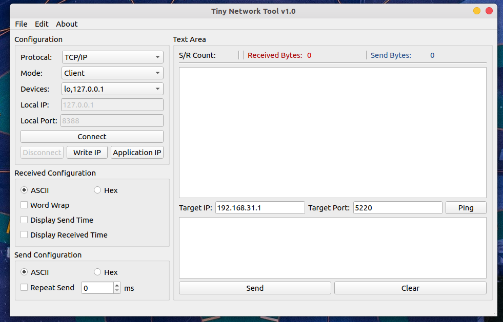

# Tiny Network Debug Tool

**A tool of TCP/UDP debug assistant on Linux in Python(PyQt5).**



## Features 

- Using the PyQt5 Core framework (Slot and Signal)
- Selected one network device from multi-network card on PC.
- Support "Ping" function.
- Base functions that have TCP(Server mode / Client mode) protocal and UDP protocal.
- Set network card a IP and get a IP from router that enable the function of DHCP. 
- Support multiple receive and send formats that include Hex and ASCII.

## How To Use

To run the project you'll need Pycharm IDE, PyQt5, Python3.x and these are libraries installed on your computer. From your command line:

``` bash
# use pip install pyqt5 using the douban mirror in China.
python -m pip install pyqt5  psutil numpy -i https://pypi.douban.com/simple
```

To pack into an app, simply type one of these:

``` shell
npm run build:osx
npm run build:linux
npm run build:win32
npm run build:win64
```

**New:** Install with your familiar package manager. Check out [images maintained by the community](https://github.com/geeeeeeeeek/electronic-wechat/wiki/System-Support-Matrix#%E7%A4%BE%E5%8C%BA%E8%B4%A1%E7%8C%AE%E7%9A%84%E5%AE%89%E8%A3%85%E5%8C%85)!

**New:** Or, with homebrew!

```bash
brew cask install electronic-wechat
```

#### [Download Released deb](https://github.com/lifimlt/tinyNetwork/releases)

#### License [GNU General Public License v3.0](LICENSE)

*Network TCP/UDP Debug Tool* is released by this open source project. Born on 2020 Spring Festival Day in China.